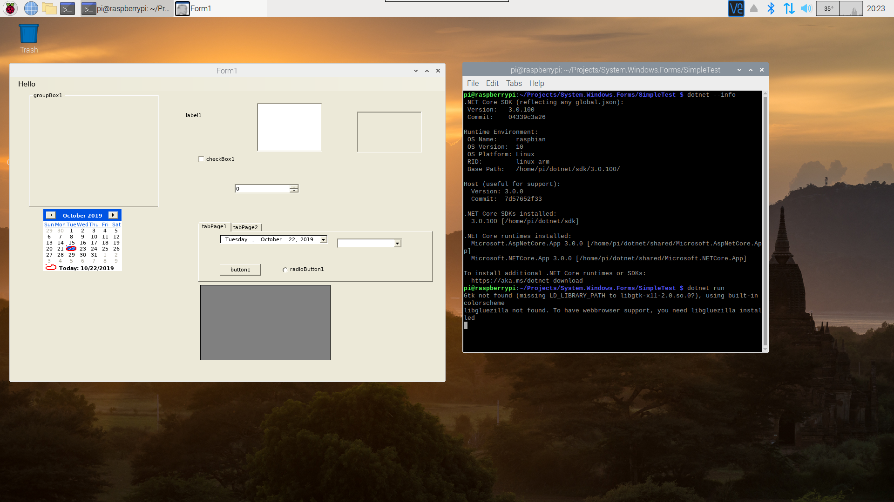

# System.Windows.Forms for .Net Core running on Windows and Linux
This is a early stage and experimental port of Mono's System.Windows.Forms and a few additional libraries to .Net 6.0+. This allows Winforms code to run on both Windows and Linux (and possibly MacOS in the future).

Rather then porting Mono's implementation of System.Drawing to .Net 6.0 I ported Mono's System.Windows.Forms onto System.Drawing.Common. Note that on Linux you will need some native libraries.

Even though this is highly experimental and unsupported it does work (at least for me).

Builds are available via Nuget from the package Core.System.Windows.Forms or at https://www.nuget.org/packages/Core.System.Windows.Forms/. 

As of Alpha 4 this targets .Net 6.0 instead of .Net Core 3.1.

A Demo on my Raspberry Pi 4, built and running on the Pi using .Net Core 3.1.

# Platform Requirements
Windows - None known

Linux - Several native libraries, at least libx11 (libx11-dev on Ubuntu) and libgdiplus (libgdiplus on Ubuntu)

Mac - Not currently working. The Mono code that this is based on was 32 bit only. .Net Core requires 64 bit so until that is done this will not work.
# Samples
There are three samples: SimpleTest (which uses my .Net Core Winforms), SimpleTest.NetCore (which uses the official .Net Core Winforms) and SimpleTest.NetFX which uses Net Framework. This also shows how to use the same source code with all three different platforms as the code is added as a link to the NetCore and NetFX projects. This way you can use the officially supported and nice looking Winforms on Windows.

To test this on Linux simply dotnet run in the SimpleTest folder.

More samples are coming soon TM. This will include more complex forms and more demonstrations of using the different libraries for different platforms.

I tested the SimpleTest example on Windows, Raspbian Buster and Ubuntu 20.04 using .Net Core 3.1 Release.

# Future Work
Unknown right now. I will likely add more samples and fix issues as I go. If Mono adds support for Mac 64 bit I will port that over.

I will add better Linux documentation as I have time.

# License
The Mono code is under the MIT license (https://github.com/mono/mono/blob/master/LICENSE). My contributions are under the MIT license as well.
